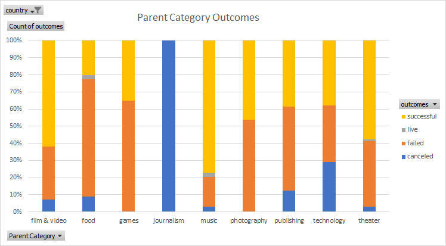

# An Analysis of Kickstarter Campaigns

This data analysis determines specific factors that would make a project's campaign successful.
In addition, different campaign categories and subcategories along with Goal and Pledged amount were examined using different statistical methods to draw very detailed conclusions to help Louise decide on the ideal campaign. 

[Kickstarter_Campaign_Analysis](https://github.com/nadiezhdamhb/Kickstarter_Analysis_1/blob/main/Kickstarter_Practice.zip)

